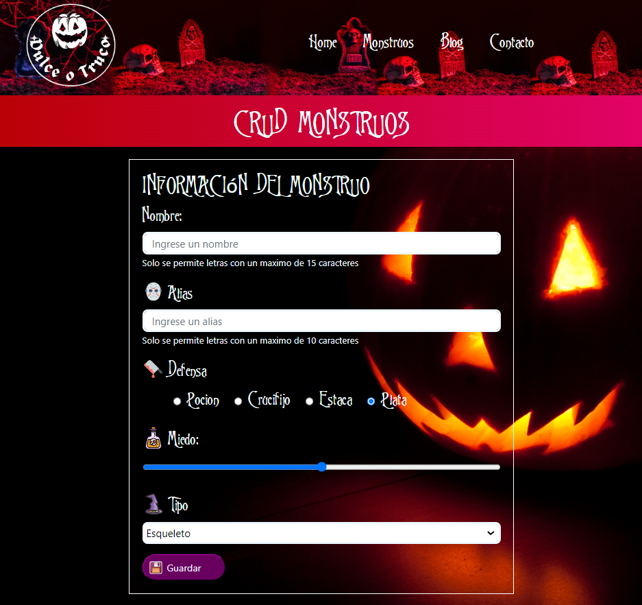

# Bienvenidos a Halloween Town

Es una aplicación SPA (Single Page Application) destinada a la administración y registro de monstruos de Halloween.

Con la creación de un CRUD (Create, Read, 
Update, Delete) que permitirá a nuestro cliente mantener un registro completo de los monstruos, además agregar nuevos huéspedes, actualizar o eliminar a los que visiten el lujoso Hotel Transylvania. 

    

Se puede ver la visualización de aquellos ya registrados y tiene una sección de filtro por tipo de monstruo. Además de poder seleccionar que columnas son visibles, calcula el promedio de nivel de miedo de los monstruos representados en la tabla.

#### Tipos

- Esqueleto
- Zombie
- Vampiro
- Fantasma
- Bruja
- Hombre Lobo

    

## Formulario 

Al hacer click en 
algún elemento de la lista, se cargarán los valores del monstruo seleccionado en el 
formulario. 

    

Se habilitará los botones para **permitir cancelar 
la edición o eliminar** el monstruo. Para **dar de alta un nuevo monstruo se utilizará el 
mismo botón que el de modificar**, el cual cambia el texto identificando la acción que 
desencadenará.

    

Se mostrará un spinner mientras se carga un nuevo monstruo o se elimina.

    

## Página Principal

Se muestran los elementos 
almacenados en la página principal de la aplicación.
Este consume los datos guardados en el server y se genera dinámicamente las 
cards de Monstruos.

    

